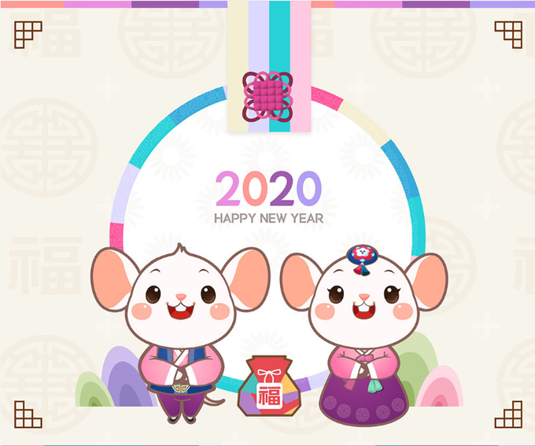

name: inverse
class: center, middle, inverse
layout: true
title: 2020
---

# 2020 경자년 쥐띠
## 흰 쥐의 해

---

---

template: inverse
class: middle

## Vaatz 플랫폼팀

---

layout: false

## Vaatz 플랫폼팀

* VaaTZ(Value Advanced Automotive Trade Zone)
* 플랫폼팀
* MSA, 블록체인

---

template: inverse
class: middle

## 교육

---

layout: false

## 교육

* 팀/실 방향성 align 된 교육(MSA, 블록체인, 보안, Nexa, 머신러닝)
* 타당성 有 교육/세미나 Okay
* IDP 면담
* 한정된 금액(Online)
* 한정된 시간(업무에 지장)

---

template: inverse
class: middle

## Labor vs Work

---

layout: false

## Labor vs Work

* Labor
* Work
* 공산주의

---

template: inverse
class: middle

## Work + Alpha

---

layout: false

## Work + Alpha

* 보이지 않는 일 + 어려운 일
* Co-Work(직무 유기)
* Servitization

---

template: inverse
class: middle

## 차세대 Leader

---

layout: false

## 차세대 Leader

* 우수사원(CES)
* <U>대학원 석박사과정</U>
* <U>MBA</U>

---

template: inverse
class: middle

## 팀장 역할

---

layout: false

## 팀장 역할

* <U>팀 Vision 제시</U>
* 팀원이 일할수 있는 환경 → <U>팀원 역량 향상</U>
* 운영팀 + ICT + Autoever
* 건강 + 모두 소중
* <u>신규 인원</u>

---

template: inverse
class: middle

## 신 인사제도

---

layout: false

## 신 인사제도

* Level
* 개인 어필(메일 공유)
* 승진포인트
* 복지혜택

---

template: inverse
class: middle

## WAR

---

layout: false

## WAR

* 프로야구 통계 지표 WAR(대체 선수 대비 기여도)
* 팀장 WAR → **팀원 WAR**

---

template: inverse
class: middle

## 바라는것

---

layout: false

## 바라는것

* 비즈니스 + IT 전문가
* Co work(**직무유기**)
* 선제안