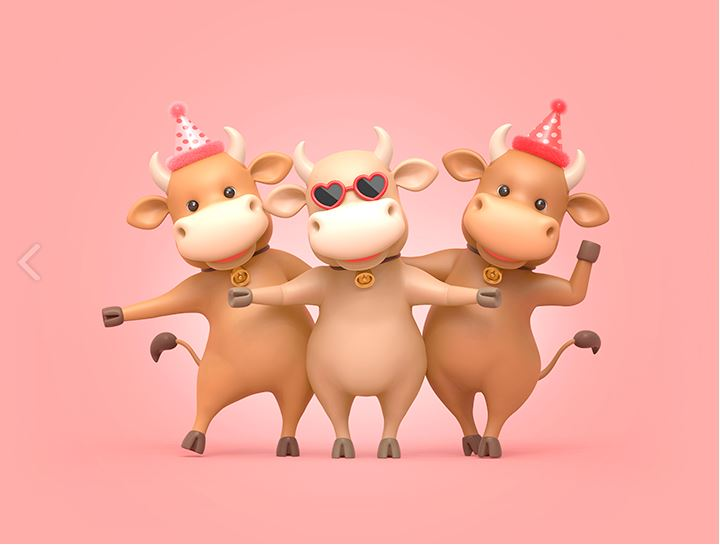

name: inverse
class: center, middle, inverse
layout: true
title: 2021
---

# 2020 신축년 소띠
## 흰 소

---

---

template: inverse
class: middle

## COVID 19

---

layout: false

## COVID 19

* 재택근무
* 비대면 대응
* 건강

---

template: inverse
class: middle

## 컨테이너

---

layout: false

## 컨테이너

* MainFrame → Unix → Cloud Container
* Spring

---

template: inverse
class: middle

## 교육

---

layout: false

## 교육

* 팀/실 방향성 align 된 교육(MSA, 블록체인, 보안, Nexa, 머신러닝)
* 보고서 / 리더십 / 프레젠테이션

---

template: inverse
class: middle

## 결재 

---

layout: false

## 결재

* 책임 전이/전가 X → 책임 공동
* 서로 Consensus 합의

---

template: inverse
class: middle

## 인성

---

layout: false

## 인성

* 가슴이 따듯한 사람이 조직에서는 성과를 낸다.
* 보이지 않는 일 + 어려운 일
* Co-Work(직무 유기)

---

template: inverse
class: middle

## 차세대 Leader

---

layout: false

## 차세대 Leader

* 우수사원(CES)
* <U>대학원 석박사과정</U>
* <U>MBA</U>

---

template: inverse
class: middle

## VCL

---

layout: false

## VCL

* 선택과 집중
* 하려는 사람에 집중하려고 함.
* 등 떠밀어서 하는일은 하지 않으려고 함.
* 셀프노미네이션

---

template: inverse
class: middle

## 바라는것

---

layout: false

## 바라는것

* 데이터 전문가
* 비즈니스 + IT 전문가
* Co work(**직무유기**)
* 선제안

---

template: inverse
class: middle

## No Pain, No Gain