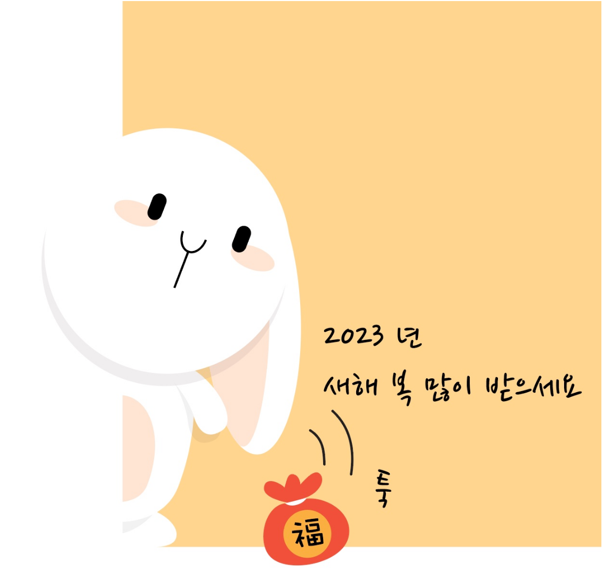

name: inverse
class: center, middle, inverse
layout: true
title: 2021
---

# 2023 계묘년 토끼띠
## 검은 토끼띠

---

---

template: inverse
class: middle

## ADM이란?

---

layout: false

## ADM

* ADM정체성
  * 비즈니스 + IT 전문가   = ?
* 비즈니스  =  SME(Subject Matter Expert) = ?
* IT 전문가 =  Front + Backend = Full-Stack 개발

---

template: inverse
class: middle

## 협 업

---

layout: false

## 협 업

* 협업 Tool 
  * Confluence : Vaatz 내부 지식
  * Teams : 주간업무 및 자료 취합(Teams랑 One-Note연결) 
  * Dooray : 외주 소통 채널(비대면 대응)
* Co work(**직무유기**)
  * W/G별 공용 노트북(개발 환경)

---

template: inverse
class: middle

## 生存(생존)

---

layout: false

## The Hunger Games

* Ignite
* Subscription

---

template: inverse
class: middle

## Managed Service

---

layout: false

## Managed Service

* SME / 개발 / 운영
* 운영 → 외주(단순 SR) + ADM(ESR) 
* 개발 → ADM
* 개발 그룹 = 개발 그룹 리더 ? + 개발 only

---

template: inverse
class: middle

## 교육

---

layout: false

## 교육

* 팀/실 방향성 align 된 교육(오픈소스, 개발) → 자격증
* 보고서 / 리더십 / 프레젠테이션  
* 세미나(4, 6) : 사업부/실 비전 align 된 방식으로 진행

---

template: inverse
class: middle

## 차세대 Leader

---

layout: false

## 차세대 Leader

* Sharpen your axe
* <U>대학원 석박사과정</U>
* <U>MBA</U>

---

template: inverse
class: middle

## Audit 

---

layout: false

## Audit

* 근태
* 사익/사취
  * 랜선회식
  * 외부식대

---

template: inverse
class: middle

## No Pain, No Gain → No Pain