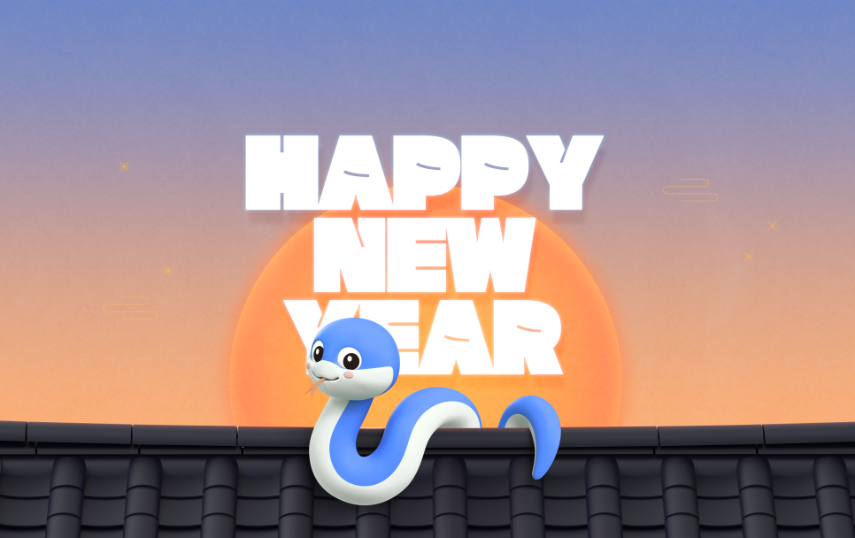

name: inverse
class: center, middle, inverse
layout: true
title: 2025
---

# 2025 을사년 푸른뱀

## 뱀띠

---

---

template: inverse
class: middle

## 완성차

---

layout: false

## 완성차

* ICT 3개년 로드맵
* 구매본부 팀장교체

---

template: inverse
class: middle

## 1.5선

---

layout: false

## 1.5선

* 생산자재 → 간단 운영(1.5) + 복잡한 운영(SM) + 개발(SM)
* 개발 → ADM
* 협업 툴
  * Teams : 주간업무 및 자료 취합(Teams랑 One-Note연결)
  * Dooray : 외주 소통 채널
  * Confluence : Vaatz 내부 지식
  * Notion : 외부자료

---

template: inverse
class: middle

## 교육

---

layout: false

## 교육

* 팀/실 방향성 align 된 교육(보안, 오픈소스, 머신러닝 ?)
* 보고서 / 리더십 / 프레젠테이션  

---

template: inverse
class: middle

## 자격증/어학

---

layout: false

## 자격증/어학

* 팀/실 방향성 align 된 자격증(보안, AWS, 데이터 )
* SPA  

---

template: inverse
class: middle

## 감사

---

layout: false

## 감사

* 근태
* 경비(사익/사취)
  * 선물
  * 외부식대

---

template: inverse
class: middle

## Workethic

---

layout: false

## Workethic

* 가슴이 따듯한 사람이 조직에서는 성과를 낸다.
* 보이지 않는 일 + 어려운 일
* Co-Work(직무 유기)

---

template: inverse
class: middle

## Leader

---

layout: false

## Leader

* Sharpen your axe
* <U>대학원 석박사과정</U>
* <U>MBA</U>

---

template: inverse
class: middle

## [25년 뜨는 기술 vx 지는 기술](https://www.itworld.co.kr/article/3630575/2025년-뜨는-기술-10가지-지는-기술-10가지.html)

|   No |     뜨는 기술      |       지는 기술       |
| ---: | :----------------: | :-------------------: |
|    1 |        송환        |     클라우드 비용     |
|    2 |     AI  파트너     |    페어 프로그래밍    |
|    3 |       러스트       |         C/C++         |
|    4 |     와즘(Wasm)     |      인터프리터       |
|    5 |        CPU         |          GPU          |
|    6 |     영지식증명     |      디지털서명       |
|    7 | 신뢰할수 있는 원장 |  튜링-완벽한 원장장   |
|    8 |      그래프QL      |         REST          |
|    9 |  정적사이트생성기  |     단일페이지 앱     |
|   10 | 데이터베이스 구성  | 소프트웨어 프로그래밍 |
